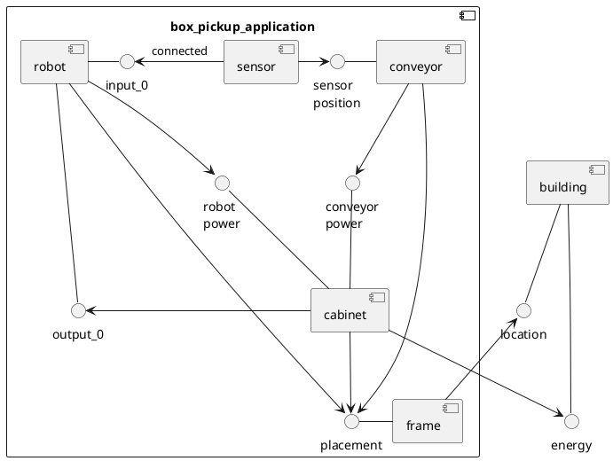

# Introduction

For technical projects where for example communication between different systems, or automated functions have to be defined, pictures say more than a thousand words. What you design will be used by your colleagues, reviewed by your teachers, or used by your future self. So properly communicating your ideas is important.

To give you an idea on what you can do by just typing in 24 lines of text with keyboard:

How would you explain in 26 lines of written text to your boss or colleague how the system will work?
This diagram was made in approximately 15 minutes from scratch and gave immediate insight that the conveyor should be controlled by the robot by means of it's cabinet power connection.

Creating diagrams in this way has advantages:
- When making these images you'll use a syntax, you'll be gently forced to write correct diagrams.
- These diagrams are made for a specific way of communicating. Just what we need.
- Working from the keyboard, describing functionality instead of burning litres of mouse-fuel in fancy GUI's will let you focus on describing your system, and not be distracted by nice colors, arrow shapes and whatnot. 
  
  During a project specs or implementations tend to change when deeper insight comes. So focussing on content instead of prettieness saves lots of time. You'll be changing your diagrams frequently.
- Using plain text makes for easy version control.
- Using a version control system enables working simultaneous and together on a project.

This guide will show you how to set up a minimal system with which you can maintain your documentation about a project.

During this guide you will have to create your own local setup. When done successfully additional instructions for other tools, tips and tricks etcetera will appear.

For example:
- How to work together on a project by using Git.
- Learn about branching and merging branches.
- Excersize creating pull requests to your team's repository.
- Creating Sequence diagrams, State machines.
- Tips and tricks when working with Visual Studio Code.
