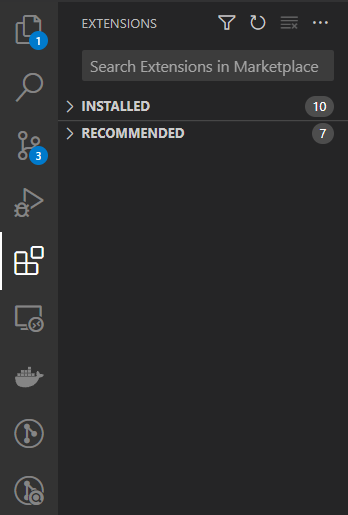
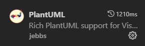
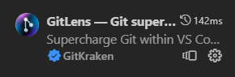

# Tools

To get started, you'll need to install Visual Studio Code, GIT, Docker and mdBook. We'll use Windows executables. You're free to use development setups and whatnot, but you're on your own when things do not work.

## Git

Git is used to maintain source code. When working with -for example- robot programs in plain text this is an ideal method of keeping track of changes. Next to that, using Git enables working together on the same project/files/documentation.

**_NOTE:_**  Git is not suitable for binary files.

Read up on installation and configuration:
- [Installing GIT](https://git-scm.com/download/win)
- [Basic GIT configuration](https://git-scm.com/book/en/v2/Getting-Started-First-Time-Git-Setup)

After installing Git for windows, open Powershell or another console and setup your credentials.
```
git config --global user.name "John Doe"
git config --global user.email johndoe@example.com
```

## Docker and PlantUML server container

For installation of Docker and the PlantUML server container follow indstructions of the screenshots `01 .. ` to `11 .. ` in the folder `src/images/docker_install`. Because the PlantUML server container exposes port `8080` as standard, you can access the container by opening a new internet client and go to the adress http://localhost:8080 to use the server.

If you have trouble accessing the container due to possibly other servers using the localhost 8080 port, please follow instructions of images `12 .. ` and `13 .. ` to change the port.

## Visual Studio Code

For writing the documentation we'll use Microsoft's Visual Studio Code. This is an IDE with various plug-ins that will help with the writing process.
Because we're not hindered by word processor software like Microsoft Word we can focus on the content and because we write in plain text, we can use Git for revisions, merging work by multiple authors, and have it displayed (rendered) in various tools.

- Download and install [Microsoft Visual Studio Code](https://code.visualstudio.com/).
- Open Microsoft Visual Studio Code (from now on abbreviated as `VS Code`).
- Open the `Extensions` tab on the left and search for packages that will help with the workflow.
 
  
- Install `PlantUML`
  
  

- Install `GitLens`

  

- Install `Markdown All in One`
  
  
 

