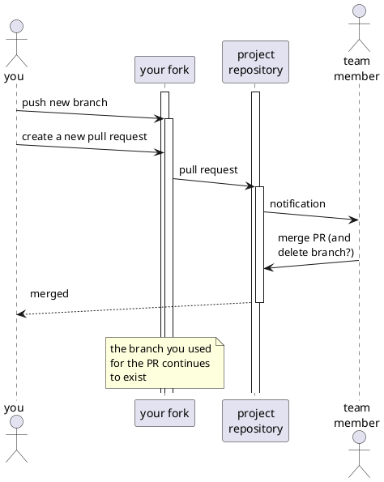

# Collaborating

It is advisable to _not_ have push access to the repository containing the project code. Instead you should work with `pull requests`.

- By doing this, you can enforce methods for checking/validating/testing code before committing to the project
- Apart from the technical side of enforcing methods, you can create a "social contract" for working together.
- you create another set of eyes that looks at your code.

You and your team should decide on the procedure of working together. As an excersize you should discuss the pitfalls ena benefits, both considered from a technical and professional point of view of:
- having somebody else than yourself merge your code to the project
- (not) having push access to the main/master project branch.
- working with/from issues/tickets in the project repository
- working with branches
- social roles and contract in the process
- other considerations ???

Your decision should be documented in your assignment and supported with diagrams.

## Example of a Pull Request procedure
(no collaboration considerations as per above)

