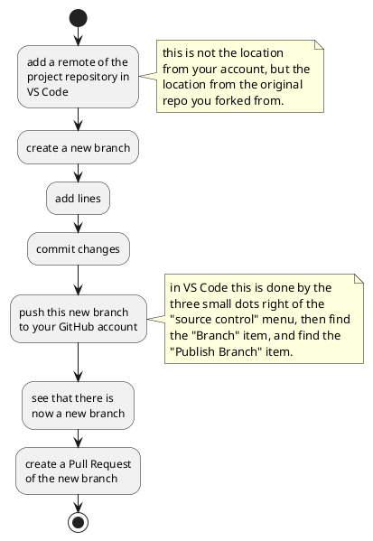

# Creating a branch

Try for yourself (as with the lyrics):

```plantuml
@startuml

skinparam backgroundColor transparent
'left to right direction

start
:add a remote of the\nproject repository in\nVS Code;
note right
    this is not the location
    from your account, but the
    location from the original
    repo you forked from.
end note
:create a new branch;
:add lines;
:commit changes;
:push this new branch\nto your GitHub account;
note right
    in VS Code this is done by the
    three small dots right of the
    "source control" menu, then find
    the "Branch" item, and find the
    "Publish Branch" item.
end note
:see that there is\nnow a new branch;
:create a Pull Request\nof the new branch;
stop
@enduml
```