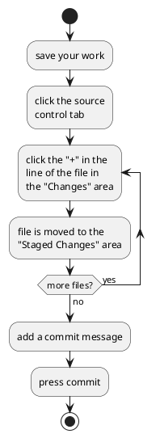

# Committing a change

When you have added or changed a piece of code of a file, you must commit that change to hour history. This is done as follows from `VS Code``:

```plantuml
@startuml

skinparam backgroundColor transparent
'left to right direction

start
:save your work;
:click the source\ncontrol tab;
repeat :click the "+" in the\nline of the file in\nthe "Changes" area;
:file is moved to the\n"Staged Changes" area;
repeat while (more files?) is (yes) not (no)
:add a commit message;
:press commit;
stop
@enduml
```