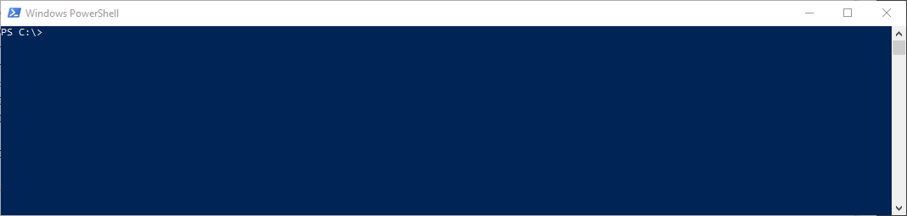
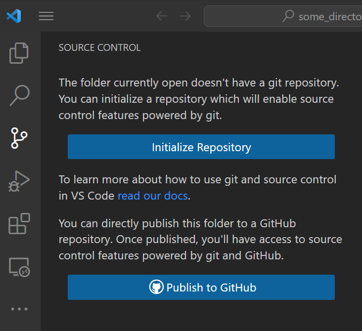

# Creating a repository

Here are 3 ways of creating a local repository:

1. From your github account: After creating the repo, clone the repo to your local disk [Forking a repository](./usage/Git.md)
  

2. Initialize an empty folder via the console by the command `git init`
  

3. Open a directory from VS code:
   -  Go to the source control tab on the right.
   -  Press the `Initialize Repository` button.

  
  