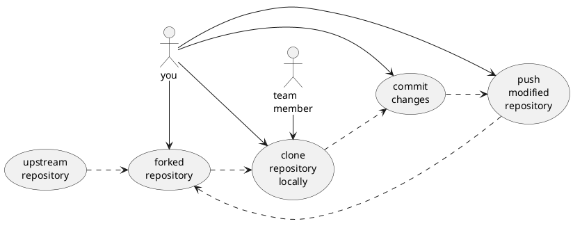
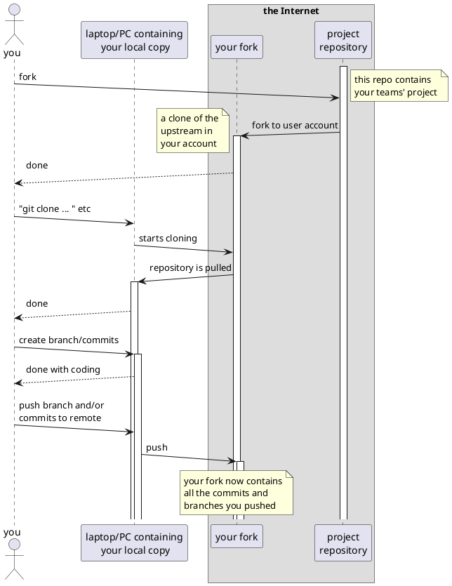

# Forking a repository

Try to understand the diagrams below. The first one is a `use case diagram` that shows interactions between actors.

Per action a `sequence diagram` can be written. Below is the sequence diagram of forking a repository to your user account on github. Changing your code is done on your development setup, A PC or Laptop containing your code and programs that you need for working with your hardware.

Changes you do, you commit locally and upload to your own fork when you have internet access.

