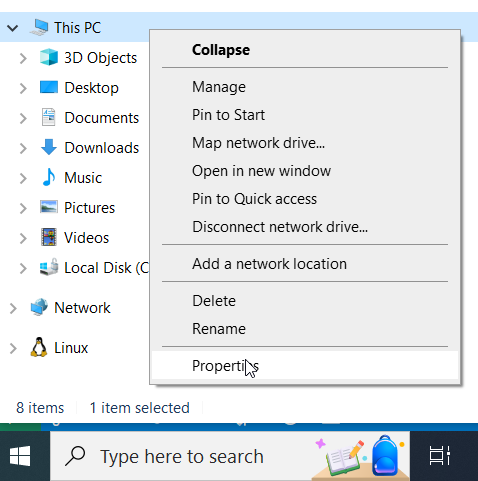
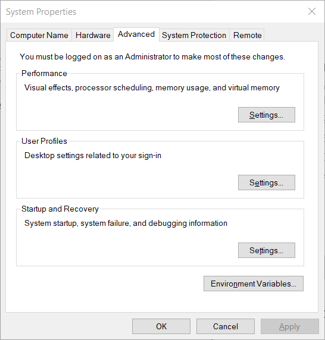
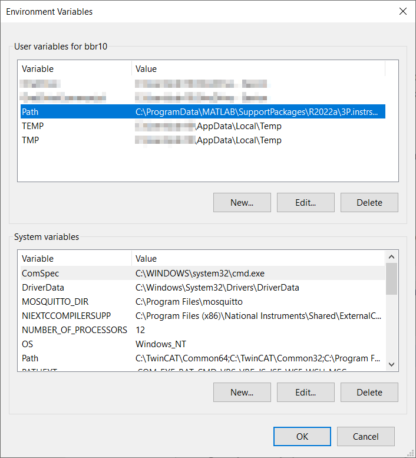
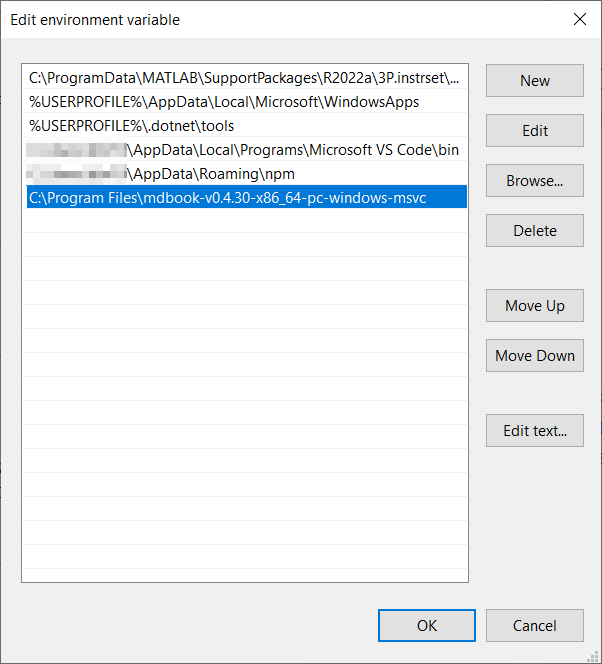

# mdBook

[mdBook](https://rust-lang.github.io/mdBook/) lets you serves your documentation in a readable way, without you having to know a lot about setting up servers. Similar [like the previous chapter](Docker.md) about Docker containers.
The difference is that mdBook specializes in creating webpages from your information in Markdown format.
As an example, see the [Rust Programming Language Documentation](https://doc.rust-lang.org/book/)

These instructions do not cover running mdBook on Linux or with a Docker image. You can try, but you're on your own.

- Go to [the mdBook Github releases page](https://github.com/rust-lang/mdBook/releases)
- Download your release and unzip it.
- Copy the content of the unzipped folder (which is a folder), called something like `mdbook-v0.4.30-x86_64-pc-windows-msvc` to `C:\Program Files`
- In the windows search bar, search for `Path` and open the `Edit the system environment variables`.
  This can also be found in other ways by searching the control panel, or by RMC on `This PC` in `Windows Explorer` and selecting `Properties`
  Then you select `Advanced system settings` in the right of the new window.
  
- Click `Environment variables` button
  
- Select the `Path` environment variable.
  
- Click `Edit` and in the newly appeared window `New` and paste the location of the folder containing the `mdBook` program that you've just moved to `C:\Program Files`. In my case it's `C:\Program Files\mdbook-v0.4.30-x86_64-pc-windows-msvc`
  
- Click `OK` and close the control panel windows.

# mdBook diagram plugin

For creating PlantUML diagrams a plugin for mdBook is needed.
- Download the `mdbook-plantuml.exe` from [https://github.com/sytsereitsma/mdbook-plantuml/releases](https://github.com/sytsereitsma/mdbook-plantuml/releases).
- copy this file to the location of the mdbook executable. The directory location you have just added to the `PATH` in the instructions above.
