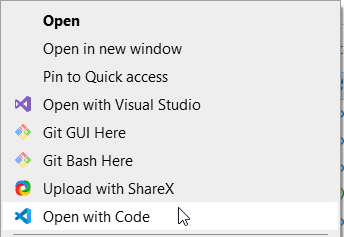
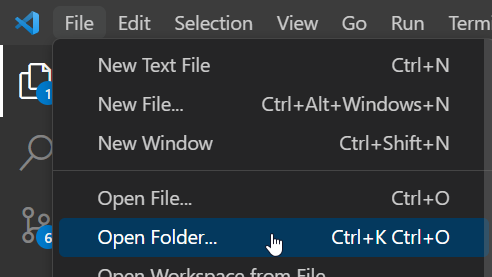
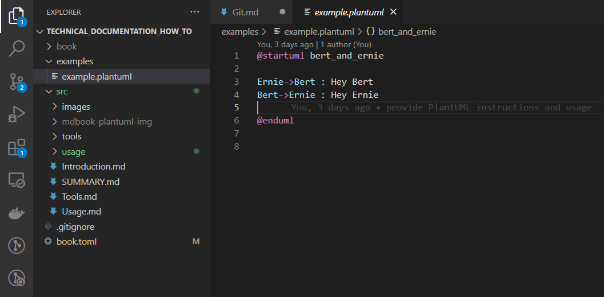

# Git clone

By cloning a Git repository (repo) you will create a local (on your computer) Git repository from somewhere else. This repository then contains all the code and commits (history). Depending on how a project is structured -by this I mean the conventions of working together- you want to inform the original repository that you have changes.

More exact info will follow on a way that this process _can_ work. But for starters you have to do the following to obtain a local copy of the repo:

- Create a [Github account](https://github.com/signup?)
- Log into your account and go to the user you want to clone a repository from (for this example, use the [this documentation tutorial](https://github.com/beeduhbee/technical_documentation_how_to))
- In github, clone the repository to your own github account by using the `Fork` button.
- Open Powershell or any other console.
- Create/move to a directory in which you want to have this repository.
- Clone the repository locally by 
  ```
  git clone https://github.com/your_user_name/technical_documentation_how_to.git
  ```
  
- Move into the newly created directory, and open the directory with `VS Code` or open the folder from within `VS Code`
  
  

  or

  

- You'll be able to see the project's content.
  