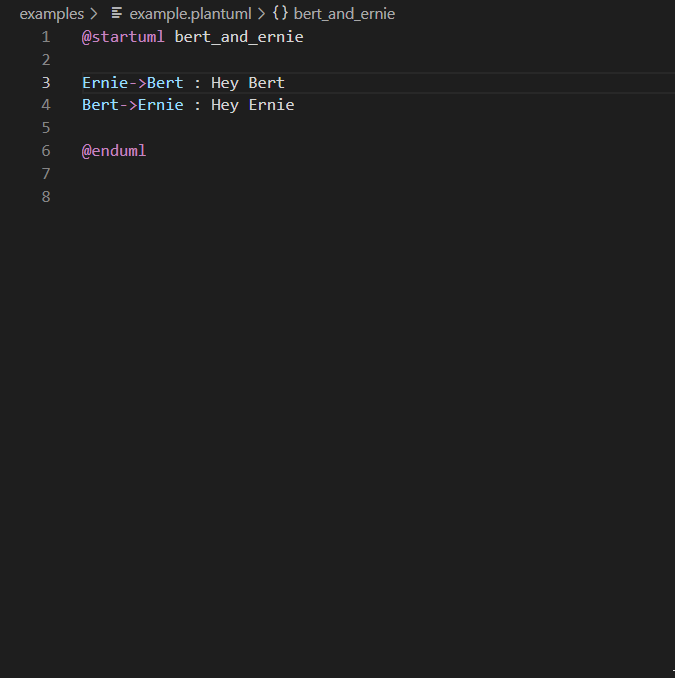

# PlantUML

## Create a PlantUML diagram

- In `VS Code` create a new file with an extension of one of the following `.wsd,.pu,.puml,.plantuml,.iuml`
- Add the following syntax to that file:
  ```
  @startuml bert_and_ernie

  Ernie->Bert : Hey Bert
  Bert->Ernie : Hey Ernie

  @enduml
  ```
- position your cursor between the `@...uml` tags and press `ALT`+`D` or do a RMK (Right Mouse Click) to see what other options you have.

   

- a preview window on the right should open, showing a sequence diagram showing Bert and Ernie talking
  
  ```plantuml
  @startuml bert_and_ernie
  
  skinparam backgroundColor transparent
  Ernie->Bert : Hey Bert
  Bert->Ernie : Hey Ernie

  @enduml
  ```
 - read up on Sequence diagrams, State diagrams, Activity diagrams!